# 🛡️ Docker Security Best Practices

<p align="center">


</p>

---

# 📖 Overview

This project demonstrates **Docker Security Best Practices** by comparing an intentionally **vulnerable Docker container** with a **secure and hardened Docker container**.

The objective is to understand common Docker security mistakes and learn how to mitigate them using OWASP Docker Top 10 recommendations and industry best practices.

The project covers:

- Docker Security Best Practices
- Multi-stage Builds
- Non-root Containers
- Secrets Management
- Read-only Filesystem
- Linux Capabilities
- Docker Socket Security
- Resource Protection
- Docker Logging
- Health Checks
- Docker Scout Vulnerability Scanning

---

# 🎯 Objectives

- Learn Docker security from a practical perspective.
- Compare vulnerable vs secure Docker configurations.
- Implement Docker hardening techniques.
- Understand OWASP Docker Top 10.
- Reduce container attack surface.
- Improve Docker image security.
- Demonstrate production-ready Docker practices.

---

# 📂 Project Structure

```text
Docker_Security_Best_Practices/
│
├── Dockerfile.secure
├── Dockerfile.vulnerable
├── docker-compose.yml
├── app.py
├── requirements.txt
├── .dockerignore
├── README.md
│
└── Screenshots/
    ├── app-running.png
    ├── appuser.png
    ├── capsh-secure.png
    ├── docker-logs.png
    ├── docker-logs-secure.png
    ├── docker-socket-mounted.png
    ├── docker-socket-not-mounted.png
    ├── environment-variables.png
    ├── filesystem-writable.png
    ├── hardcoded-secrets.png
    ├── healthcheck.png
    ├── privileged-false.png
    ├── privileged-true.png
    ├── readonly-filesystem.png
    ├── root-user.png
    ├── scout-insecure.png
    └── scout-secure.png
```

---

# 🚀 Features

## Vulnerable Container

- Runs as root
- Single-stage build
- Hardcoded secrets
- Writable filesystem
- Docker socket mounted
- Privileged container
- Default Linux capabilities
- No resource limits
- No health check

---

## Secure Container

- Multi-stage build
- Non-root user
- Slim runtime image
- Read-only filesystem
- Environment variables
- Health check
- Docker Scout scan
- Dropped Linux capabilities
- No Docker socket
- No new privileges
- CPU, Memory and PID limits

---

# ⚖️ Secure vs Vulnerable Comparison

| Feature | Vulnerable | Secure |
|----------|------------|---------|
| Multi-stage Build | ❌ | ✅ |
| Runs as Root | ✅ | ❌ |
| Non-root User | ❌ | ✅ |
| Hardcoded Secrets | ✅ | ❌ |
| Environment Variables | ❌ | ✅ |
| Docker Socket Mounted | ✅ | ❌ |
| Privileged Container | ✅ | ❌ |
| Writable Filesystem | ✅ | ❌ |
| Read-only Filesystem | ❌ | ✅ |
| Health Check | ❌ | ✅ |
| Docker Scout | High CVEs | Reduced CVEs |

---

# 🏗️ Build Images

## Build Vulnerable Image

```bash
docker build -f Dockerfile.vulnerable -t docker-security:v1 .
```

## Build Secure Image

```bash
docker build -f Dockerfile.secure -t docker-security:v2 .
```

---

# ▶️ Run Containers

## Vulnerable Container

```bash
docker run -d \
--name vulnerable-container \
--privileged \
-v /var/run/docker.sock:/var/run/docker.sock \
-p 5000:5000 \
docker-security:v1
```

---

## Secure Container

```bash
docker run -d \
--name secure-container \
--read-only \
--cap-drop=ALL \
--security-opt=no-new-privileges \
--memory=512m \
--cpus=1 \
--pids-limit=100 \
-e DB_USERNAME=admin \
-e DB_PASSWORD=StrongPassword123 \
-p 5001:5000 \
docker-security:v2
```

---

# 🖥️ Application

Open the application:

```
http://localhost:5000
```

---

## 📸 Application Running

<p align="center">
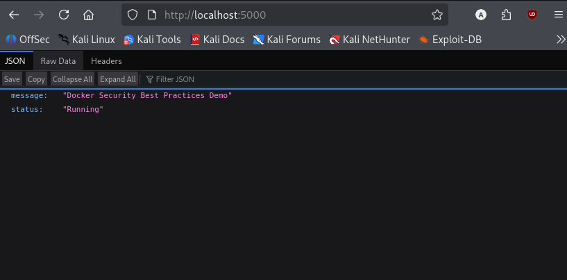
</p>

---

# 🔴 Vulnerable Container Demonstration

## 1. Running as Root

```bash
docker exec -it vulnerable-container whoami
```

Output

```
root
```

<p align="center">
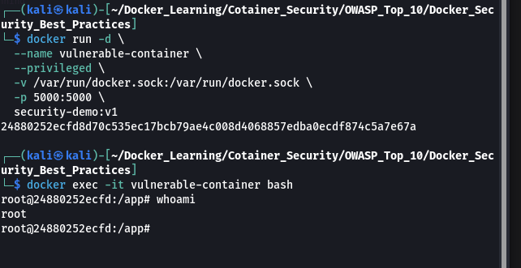
</p>

---

## 2. Hardcoded Secrets

```bash
printenv
```

<p align="center">
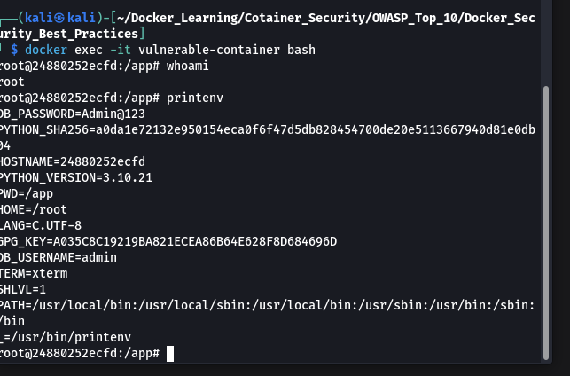
</p>

---

## 3. Docker Socket Mounted

```bash
ls -l /var/run/docker.sock
```

<p align="center">
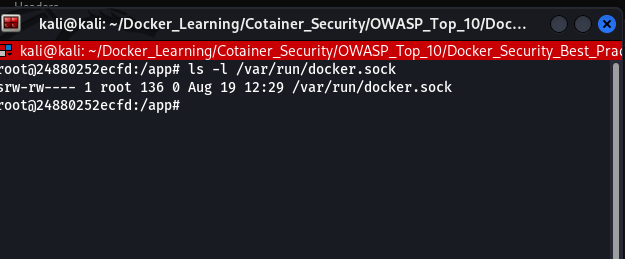
</p>

---

## 4. Writable Filesystem

```bash
touch test.txt
```

<p align="center">
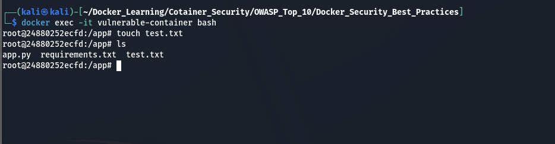
</p>

---

## 5. Privileged Container

```bash
docker inspect vulnerable-container --format='{{.HostConfig.Privileged}}'
```

Output

```
true
```

<p align="center">
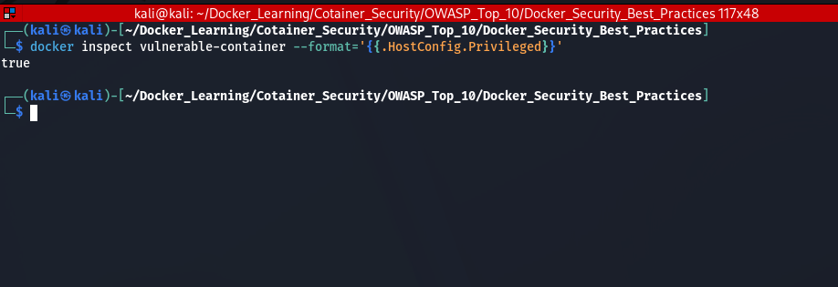
</p>

---

## 6. Docker Logs

```bash
docker logs vulnerable-container
```

<p align="center">
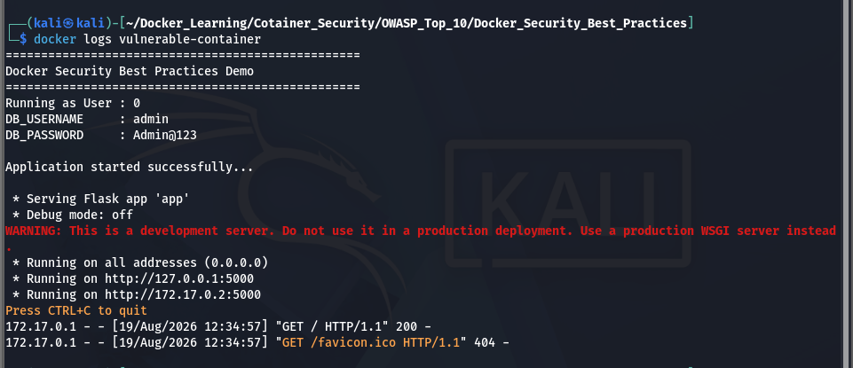
</p>

---

## 7. Docker Scout Scan

```bash
docker scout quickview docker-security:v1
```

<p align="center">
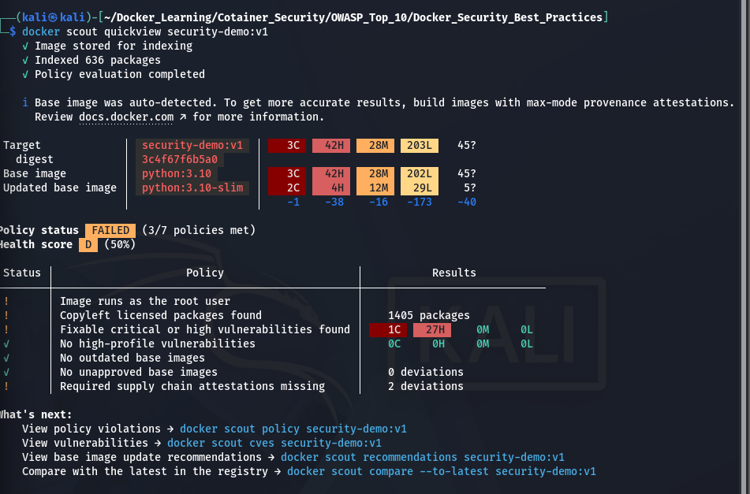
</p>

---
# 🟢 Secure Container Demonstration

The secure container implements Docker security best practices and follows the OWASP Docker Top 10 recommendations.

---

## 1. Running as Non-root User

Verify the container is running as a non-root user.

```bash
docker exec -it secure-container whoami
```

Expected Output

```
appuser
```

<p align="center">
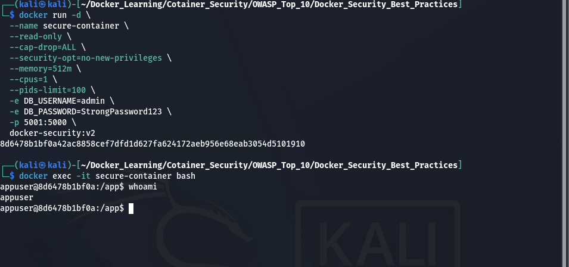
</p>

---

## 2. Environment Variables

Instead of hardcoding credentials inside the Docker image, the secure container uses environment variables.

```bash
docker exec -it secure-container printenv
```

<p align="center">
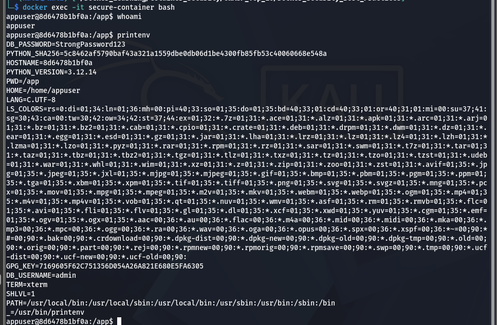
</p>

---

## 3. Read-only Filesystem

Attempt to create a file inside the secure container.

```bash
touch test.txt
```

Expected Output

```
touch: cannot touch 'test.txt': Read-only file system
```

<p align="center">
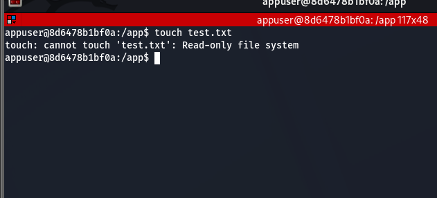
</p>

---

## 4. Docker Socket Not Mounted

Verify that the Docker socket is not accessible inside the container.

```bash
ls -l /var/run/docker.sock
```

Expected Output

```
No such file or directory
```

<p align="center">
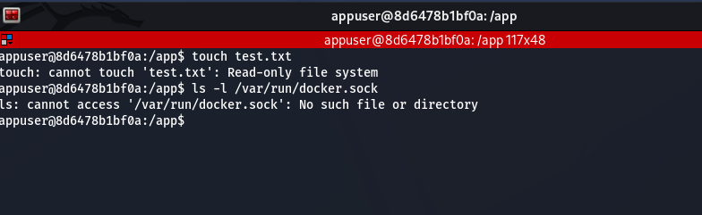
</p>

---

## 5. Non-Privileged Container

Verify the container is not running in privileged mode.

```bash
docker inspect secure-container --format='{{.HostConfig.Privileged}}'
```

Expected Output

```
false
```

<p align="center">
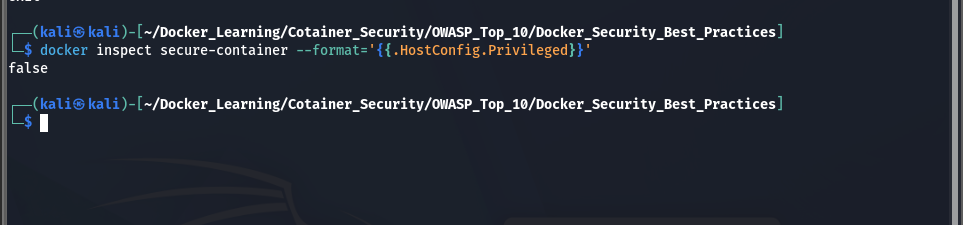
</p>

---

## 6. Docker Logs

View application logs.

```bash
docker logs secure-container
```

<p align="center">
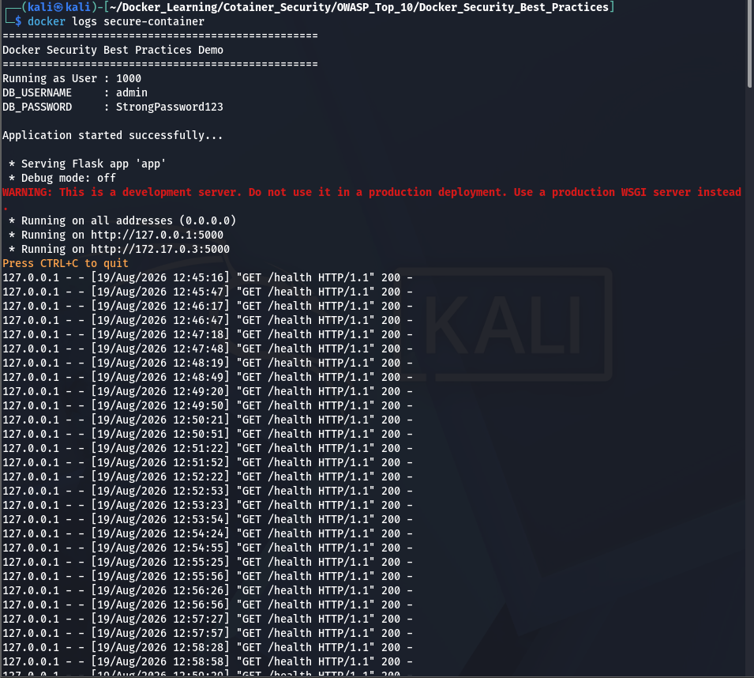
</p>

---

## 7. Health Check

The secure image includes a Docker health check to monitor application availability.

```bash
docker inspect secure-container
```

Search for

```
Health
```

<p align="center">
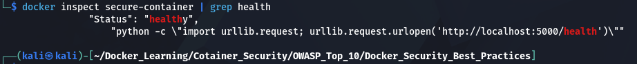
</p>

---

## 8. Linux Capabilities

The secure container drops all Linux capabilities using:

```bash
--cap-drop=ALL
```

Verify:

```bash
capsh --print
```

<p align="center">
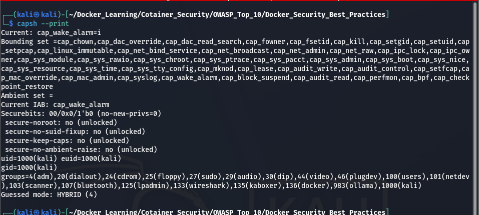
</p>

---

## 9. Docker Scout Scan

Analyze the secure image.

```bash
docker scout quickview docker-security:v2
```

<p align="center">
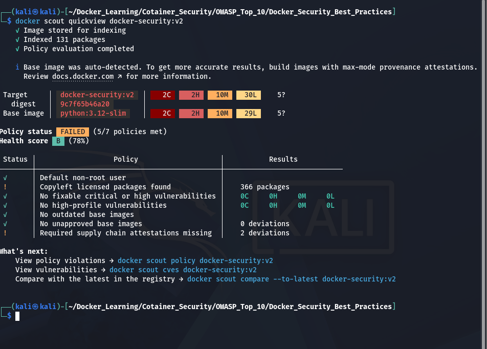
</p>

---

# 🔐 Security Improvements

| Security Control | Vulnerable | Secure |
|------------------|------------|---------|
| Multi-stage Build | ❌ | ✅ |
| Root User | ✅ | ❌ |
| Non-root User | ❌ | ✅ |
| Hardcoded Secrets | ✅ | ❌ |
| Environment Variables | ❌ | ✅ |
| Docker Socket | Mounted | Not Mounted |
| Privileged Mode | Enabled | Disabled |
| Writable Filesystem | Yes | No |
| Read-only Filesystem | No | Yes |
| Health Check | No | Yes |
| Linux Capabilities | Default | Dropped |
| Docker Scout | High CVEs | Reduced CVEs |

---

# 🛡️ OWASP Docker Top 10 Mapping

| OWASP Recommendation | Status |
|----------------------|--------|
| D01 – Running as Root | ✅ |
| D02 – Patch Management | ✅ |
| D03 – Network Segmentation | ✅ |
| D04 – Security Contexts | ✅ |
| D05 – Secrets Management | ✅ |
| D06 – Resource Protection | ✅ |
| D07 – Image Integrity & Origin | ✅ |
| D08 – Immutable Paradigm | ✅ |
| D09 – Secure Defaults & Hardening | ✅ |
| D10 – Logging | ✅ |

---

# 🚀 Docker Security Best Practices Demonstrated

- ✅ Use official Docker images
- ✅ Keep base images updated
- ✅ Use multi-stage builds
- ✅ Run containers as a non-root user
- ✅ Avoid hardcoded secrets
- ✅ Use environment variables for configuration
- ✅ Enable Docker health checks
- ✅ Mount the filesystem as read-only
- ✅ Avoid privileged containers
- ✅ Do not mount the Docker socket unless absolutely necessary
- ✅ Drop unnecessary Linux capabilities
- ✅ Apply CPU, memory, and PID limits
- ✅ Scan images regularly using Docker Scout
- ✅ Use Docker logs for monitoring and troubleshooting

---

# 📖 Key Learnings

Through this project, I learned how to secure Docker containers by applying production-ready best practices.

Some of the important lessons include:

- Containers should never run as the root user unless required.
- Multi-stage builds reduce image size and minimize the attack surface.
- Secrets should never be hardcoded inside Docker images.
- Read-only filesystems help prevent unauthorized file modifications.
- Mounting the Docker socket gives a container control over the Docker daemon and should be avoided whenever possible.
- Dropping unnecessary Linux capabilities follows the principle of least privilege.
- Resource limits improve stability and reduce the risk of denial-of-service attacks.
- Docker Scout helps identify vulnerabilities and recommends more secure base images.
- Health checks improve application reliability by allowing Docker to monitor container health.
- Proper logging simplifies monitoring and troubleshooting.

---

# 💼 Interview Questions

### Why should Docker containers avoid running as root?

Running as root increases the impact of a container compromise. Using a non-root user limits the permissions available to an attacker.

---

### Why should secrets not be hardcoded?

Hardcoded secrets become part of the image and can be extracted by anyone with access to it. Environment variables or secret management tools are safer alternatives.

---

### Why is mounting `/var/run/docker.sock` dangerous?

The Docker socket provides direct access to the Docker daemon. A container with access to this socket can control Docker on the host, potentially leading to full host compromise.

---

### What is the benefit of a read-only filesystem?

It prevents applications or attackers from modifying the container's filesystem, supporting the immutable infrastructure model.

---

### Why use multi-stage builds?

Multi-stage builds separate the build environment from the runtime environment, resulting in smaller, cleaner, and more secure images.

---

### What is Docker Scout?

Docker Scout is a security analysis tool that scans container images for known vulnerabilities, outdated packages, and recommends more secure base images.

---

# 🎯 Conclusion

This project demonstrates how a vulnerable Docker container can be transformed into a secure, production-ready deployment by applying Docker security best practices.

By comparing insecure and hardened configurations side by side, it highlights the importance of following the OWASP Docker Top 10 recommendations, implementing least privilege, reducing the attack surface, managing secrets securely, and continuously monitoring container images.

This capstone serves as a practical reference for Docker security, interview preparation, and real-world container hardening.

---

## ⭐ If you found this project helpful, consider giving the repository a star!
