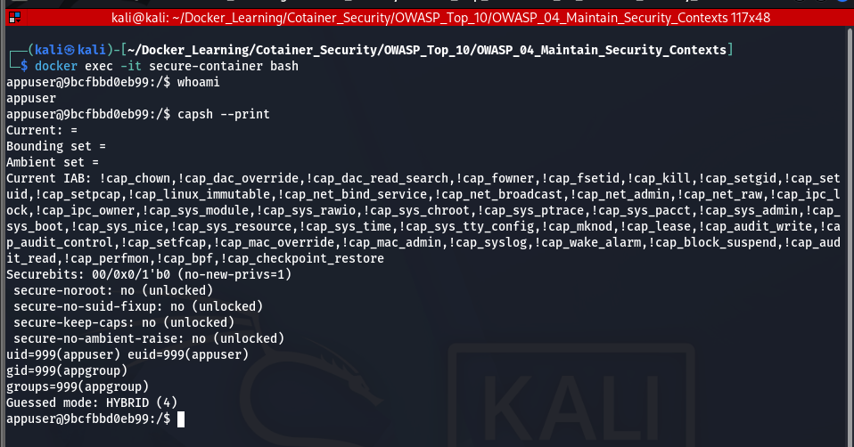
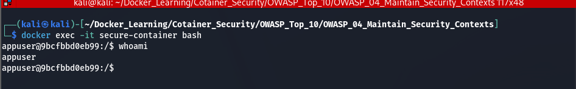
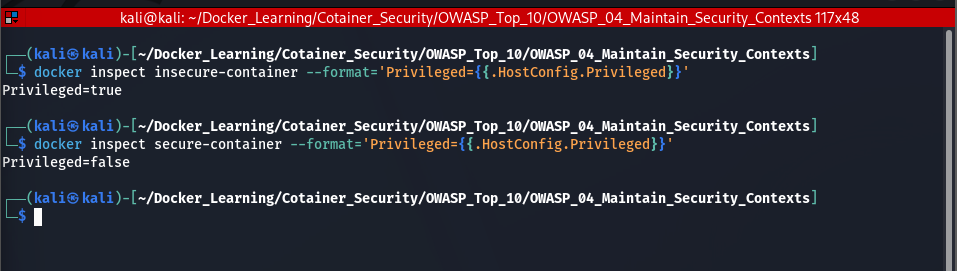
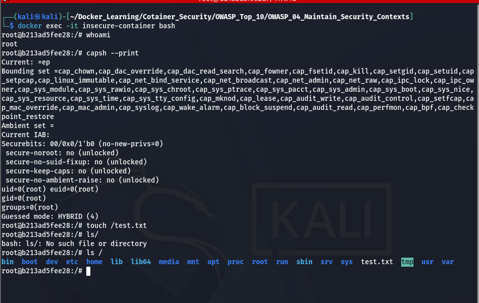
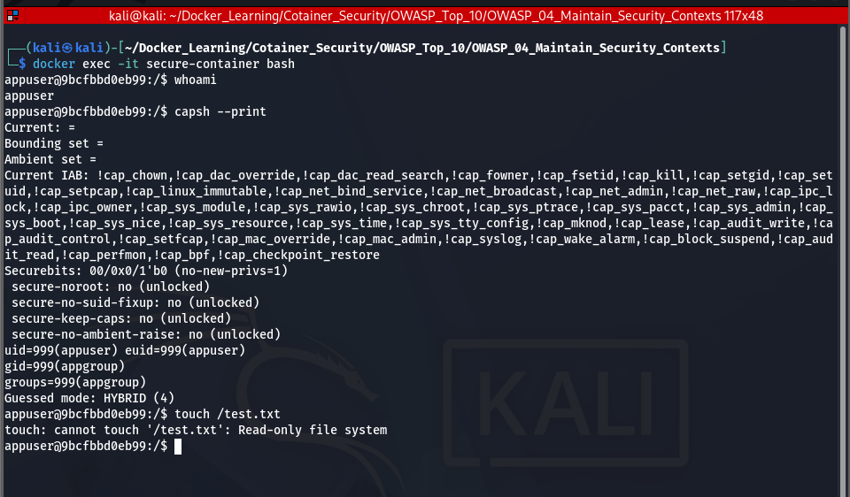

# Screenshots

## 1. Linux Capabilities (Privileged Container)

The vulnerable container runs with elevated privileges, giving it significantly more capabilities than required.



---

## 2. Secure Container Running as Non-Root

The secure container runs as a dedicated non-root user (`appuser`), reducing the impact of a potential compromise.



---

## 3. Privileged vs Non-Privileged Container

Comparison of the `Privileged` setting for both containers.

- Vulnerable Container → `Privileged=true`
- Secure Container → `Privileged=false`



---

## 4. Writable Filesystem (Vulnerable)

The vulnerable container allows creating files in the root filesystem.

```bash
touch /test.txt
```



---

## 5. Read-Only Filesystem (Secure)

The secure container uses a read-only root filesystem. Attempts to create files fail.

```bash
touch /test.txt
```

Expected output:

```text
touch: cannot touch '/test.txt': Read-only file system
```


