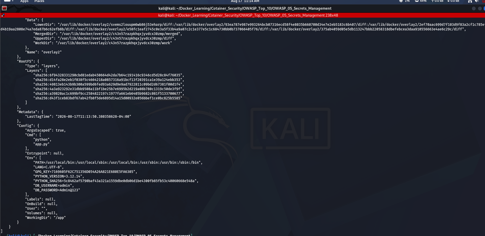
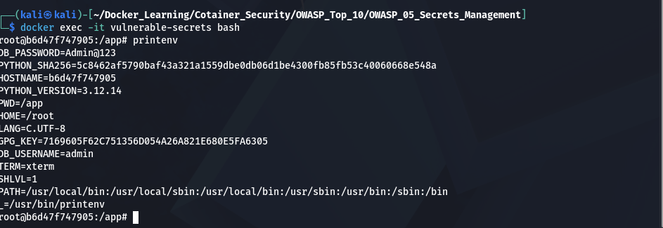
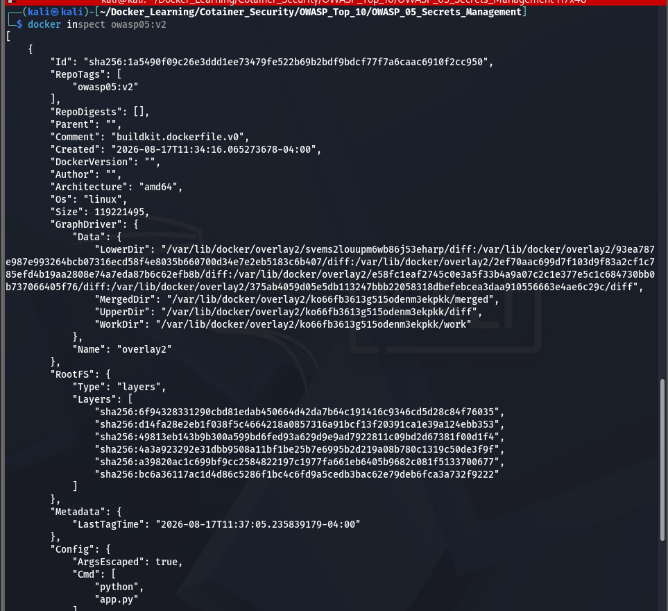

# OWASP Docker Top 10 #5 – Secrets Management

## Objective

This lab demonstrates insecure and secure methods of managing secrets in Docker containers. It shows how hardcoded credentials can be exposed and how secrets should be injected securely at runtime.

---

# What is Secrets Management?

Secrets Management is the practice of securely storing and accessing sensitive information such as:

- Database passwords
- API Keys
- Access Tokens
- SSH Keys
- Certificates

Secrets should **never be hardcoded** into Docker images or application source code.

---

# Lab Structure

```
OWASP_05_Secrets_Management/
│
├── Dockerfile.vulnerable
├── Dockerfile.secure
├── app.py
├── README.md
└── Screenshots/
```

---

# Vulnerable Configuration

The vulnerable image stores credentials using Dockerfile environment variables.

```dockerfile
ENV DB_USERNAME=admin
ENV DB_PASSWORD=Admin@123
```

Build:

```bash
docker build -f Dockerfile.vulnerable -t owasp05:v1 .
```

Run:

```bash
docker run -d --name vulnerable-secrets owasp05:v1
```

---

# Secure Configuration

The secure image contains no embedded credentials.

Build:

```bash
docker build -f Dockerfile.secure -t owasp05:v2 .
```

Run:

```bash
docker run -d \
--name secure-secrets \
-e DB_USERNAME=admin \
-e DB_PASSWORD=StrongPassword123 \
owasp05:v2
```

---

# Verification

Display environment variables:

```bash
docker exec -it vulnerable-secrets sh

printenv
```

Observe that credentials are visible inside the vulnerable container.

Inspect image:

```bash
docker inspect owasp05:v1
```

---

# Security Comparison

| Vulnerable | Secure |
|------------|--------|
| Hardcoded credentials | Runtime secrets |
| Secrets stored in image | Secrets not embedded |
| Credentials exposed | Better separation of secrets |

---

# Screenshots
## 1. Hardcoded Secrets in the Vulnerable Image

The vulnerable Docker image contains database credentials that are embedded using Dockerfile environment variables.



---

## 2. Exposed Secrets Using `printenv`

An attacker with access to the running container can list environment variables and view sensitive information such as database credentials.

```bash
printenv
```



---

## 3. Secure Image Verification

The secure Docker image does not contain hardcoded credentials. Secrets are provided at runtime, making the image reusable without exposing sensitive information.

```bash
docker inspect owasp05:v2
```


---

# Best Practices

- Never hardcode secrets.
- Do not commit `.env` files.
- Use Docker Secrets.
- Use Kubernetes Secrets.
- Use HashiCorp Vault or cloud secret managers.
- Rotate secrets regularly.

---

# Conclusion

Secrets should never be embedded inside Docker images. Instead, inject them securely at runtime using dedicated secret management solutions.
