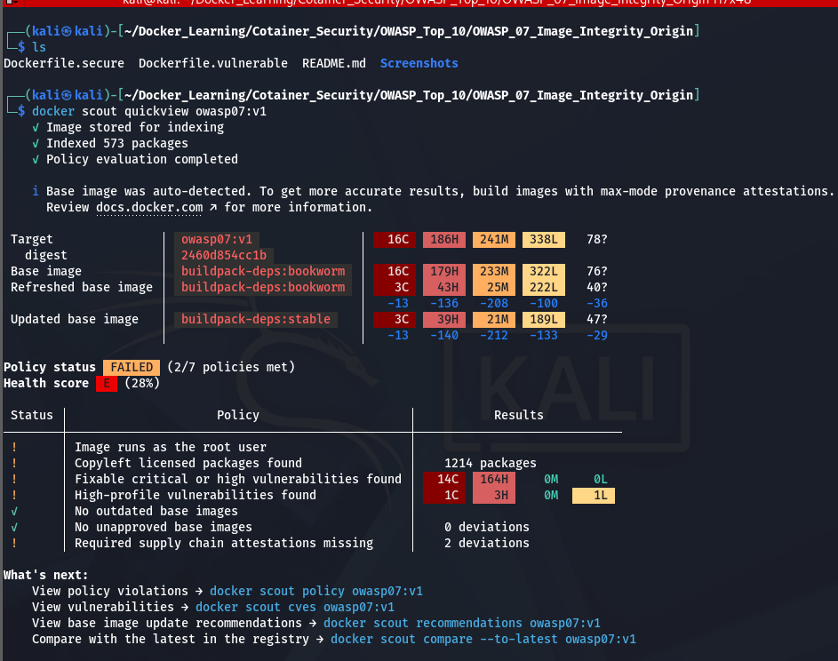
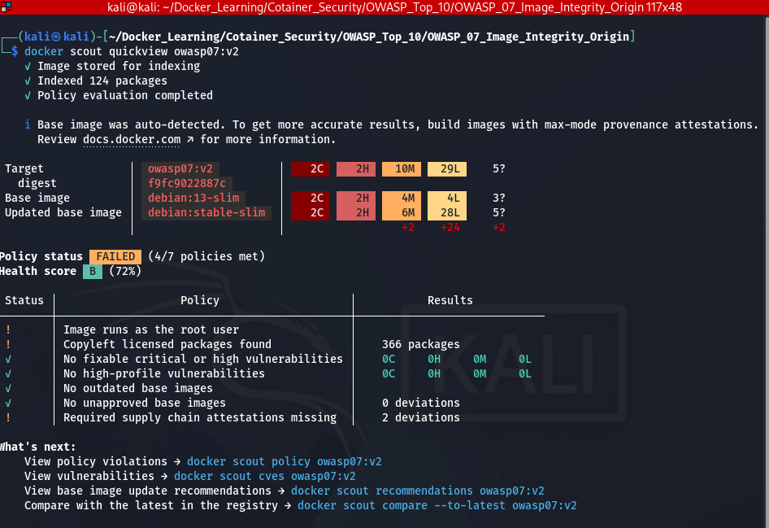
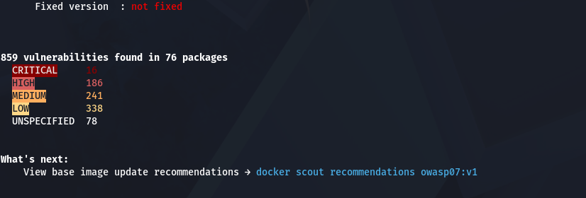
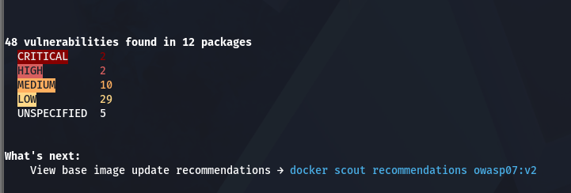
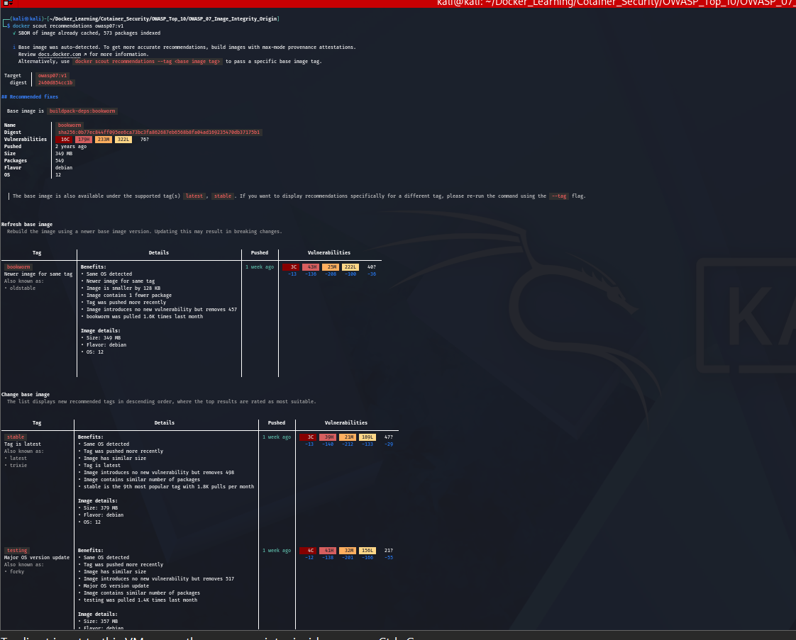

# OWASP Docker Top 10 #7 – Image Integrity & Origin

## Objective

This lab demonstrates how Docker Scout can be used to analyze container images, identify outdated base images, detect known vulnerabilities, and recommend more secure alternatives.

---

# What is Image Integrity & Origin?

Image Integrity ensures that container images have not been modified or tampered with.

Image Origin verifies that images come from trusted publishers and repositories.

Using outdated or untrusted images increases the risk of running vulnerable software.

---

# Lab Structure

```
OWASP_07_Image_Integrity_Origin/
│
├── Dockerfile.vulnerable
├── Dockerfile.secure
├── README.md
└── Screenshots/
```

---

# Vulnerable Configuration

Uses an outdated base image.

```dockerfile
FROM python:3.7
```

Build:

```bash
docker build -f Dockerfile.vulnerable -t owasp07:v1 .
```

---

# Secure Configuration

Uses a newer supported image.

```dockerfile
FROM python:3.12-slim
```

Build:

```bash
docker build -f Dockerfile.secure -t owasp07:v2 .
```

---

# Verification

Analyze the vulnerable image.

```bash
docker scout quickview owasp07:v1
```

View CVEs.

```bash
docker scout cves owasp07:v1
```

View recommendations.

```bash
docker scout recommendations owasp07:v1
```

Compare images.

```bash
docker scout compare owasp07:v1 --to owasp07:v2
```

---

# Security Comparison

| Vulnerable | Secure |
|------------|--------|
| Old base image | Updated base image |
| Many CVEs | Reduced CVEs |
| Poor health score | Better health score |
| Outdated packages | Updated packages |

---

# Docker Scout Benefits

Docker Scout helps to:

- Detect outdated base images.
- Identify known vulnerabilities (CVEs).
- Recommend secure base image updates.
- Improve software supply chain security.
- Maintain healthier container images.

---

# Screenshots

## 1. Docker Scout Quick View – Vulnerable Image

The vulnerable image uses an outdated base image (`python:3.7`). Docker Scout identifies multiple known vulnerabilities and assigns a lower health score.

```bash
docker scout quickview owasp07:v1
```



---

## 2. Docker Scout Quick View – Secure Image

The secure image uses a newer and supported base image (`python:3.12-slim`), resulting in significantly fewer vulnerabilities and an improved health score.

```bash
docker scout quickview owasp07:v2
```



---

## 3. CVE Analysis – Vulnerable Image

Docker Scout lists all known Common Vulnerabilities and Exposures (CVEs) present in the vulnerable image, helping identify security risks associated with outdated packages.

```bash
docker scout cves owasp07:v1
```



---

## 4. CVE Analysis – Secure Image

After updating the base image, Docker Scout reports a significant reduction in the number of known vulnerabilities, demonstrating the importance of keeping base images up to date.

```bash
docker scout cves owasp07:v2
```



---

## 5. Docker Scout Recommendations

Docker Scout analyzes the image and recommends updating the base image to a newer supported version. Updating the base image reduces hundreds of known vulnerabilities and improves the overall security posture.

```bash
docker scout recommendations owasp07:v1
```




---

# Best Practices

- Use official images.
- Avoid mutable tags like `latest`.
- Keep base images updated.
- Scan images regularly with Docker Scout.
- Pin images by version or digest.

---

# Conclusion

Maintaining image integrity starts with using trusted and updated base images. Docker Scout helps identify vulnerabilities and provides actionable recommendations to improve container security.
