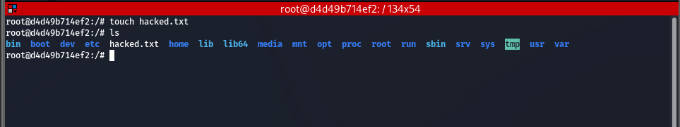
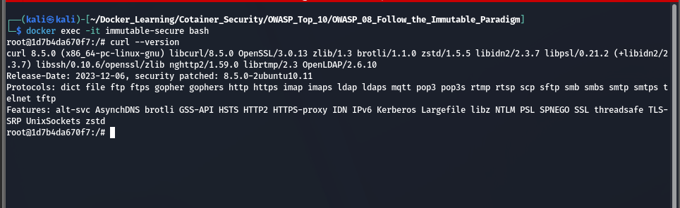

# OWASP Docker Top 10 #8 – Follow the Immutable Paradigm

## Objective

This lab demonstrates the importance of treating Docker containers as **immutable**. Instead of modifying a running container, all changes should be made in the Dockerfile, followed by rebuilding the image and redeploying the container.

---

# What is the Immutable Paradigm?

The **Immutable Paradigm** means that once a container is deployed, it should never be modified.

If an application requires updates or additional software:

- ❌ Do not install packages inside a running container.
- ❌ Do not edit application files manually.
- ❌ Do not patch containers directly.

Instead:

- ✅ Modify the Dockerfile.
- ✅ Build a new image.
- ✅ Deploy a new container.

This approach ensures consistency, repeatability, and improved security.

---

# Lab Structure

```
OWASP_08_Follow_the_Immutable_Paradigm/
│
├── Dockerfile.vulnerable
├── Dockerfile.secure
├── README.md
└── Screenshots/
```

---

# Vulnerable Configuration

The vulnerable container is started with a minimal Ubuntu image.

```dockerfile
FROM ubuntu:24.04

CMD ["sleep","infinity"]
```

Build the image:

```bash
docker build -f Dockerfile.vulnerable -t owasp08:v1 .
```

Run the container:

```bash
docker run -d --name immutable-vulnerable owasp08:v1
```

Modify the running container:

```bash
apt update
apt install -y curl
touch hacked.txt
```

These manual changes exist only in the current container and are lost when the container is removed.

---

# Secure Configuration

The secure image installs the required package during the image build process.

```dockerfile
FROM ubuntu:24.04

RUN apt-get update && \
    apt-get install -y curl && \
    apt-get clean && \
    rm -rf /var/lib/apt/lists/*

CMD ["sleep","infinity"]
```

Build the image:

```bash
docker build -f Dockerfile.secure -t owasp08:v2 .
```

Run the container:

```bash
docker run -d --name immutable-secure owasp08:v2
```

The required software is already available without modifying the running container.

---

# Verification

Check the installed package in the vulnerable container:

```bash
curl --version
```

Create a file:

```bash
touch hacked.txt
```

Remove and recreate the container:

```bash
docker rm -f immutable-vulnerable

docker run -d --name immutable-vulnerable owasp08:v1
```

Verify that the file and installed package are no longer present.

---

# Security Comparison

| Vulnerable | Secure |
|------------|--------|
| Packages installed after deployment | Packages installed during image build |
| Running container manually modified | Image rebuilt for changes |
| Configuration drift | Consistent deployments |
| Manual changes lost after recreation | Reproducible deployments |
| Mutable container | Immutable container |

---

# Screenshots

## 1. Installing Software in the Running Container

The vulnerable container allows packages to be installed after deployment, which modifies the running container and violates the immutable container principle.

```bash
apt update
apt install -y curl
```


---

## 2. Verifying the Installed Package

After installation, the `curl` binary is available inside the running container.

```bash
curl --version
```


---

## 3. Creating a File in the Running Container

A file is manually created inside the container.

```bash
touch hacked.txt
```



---

## 4. Removing and Recreating the Container

The modified container is deleted and recreated from the original image.

```bash
docker rm -f immutable-vulnerable

docker run -d --name immutable-vulnerable owasp08:v1
```


---

## 5. Manual Changes Are Lost

After recreating the container, the previously created file no longer exists.

```bash
ls
```


---

## 6. Package No Longer Exists

Since the container was recreated from the original image, the manually installed package is no longer available.

```bash
curl --version
```


---

## 7. Secure Image

The secure image includes the required package during the build process, so no manual modifications are necessary after deployment.

```bash
curl --version
```



---

# Best Practices

- Treat containers as immutable.
- Never install software inside a running container.
- Make all changes in the Dockerfile.
- Rebuild and redeploy images instead of patching containers.
- Version container images for reliable rollbacks.
- Automate builds and deployments using CI/CD pipelines.

---

# Conclusion

This lab demonstrates the **Immutable Paradigm** recommended by the OWASP Docker Top 10. The vulnerable container is modified after deployment by installing software and creating files manually. These changes are lost when the container is recreated, resulting in configuration drift and inconsistent environments.

The secure approach installs all required software during the image build process. Future changes are made by updating the Dockerfile, rebuilding the image, and deploying a new container. This ensures consistent, reproducible, and secure deployments.
