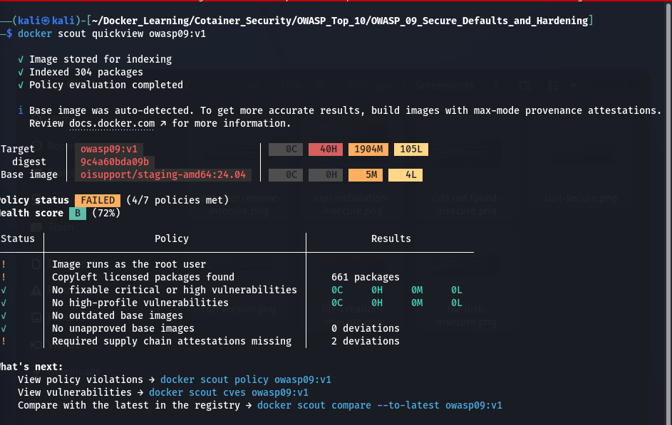
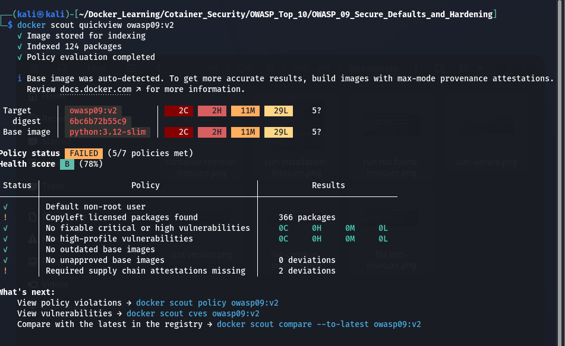
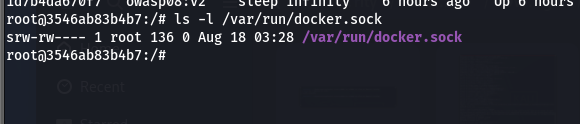
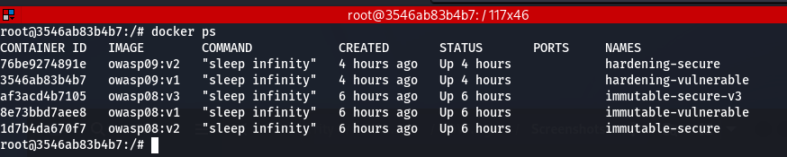
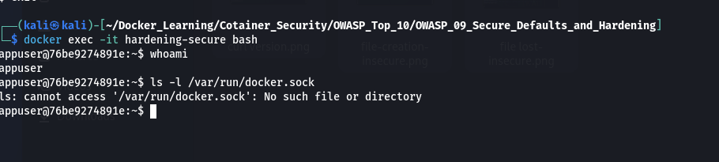

# OWASP Docker Top 10 #9 – Secure Defaults and Hardening

## Overview

Secure Defaults and Hardening focuses on reducing the attack surface of Docker containers by using secure configurations, minimal privileges, and hardened runtime settings.

In this lab, we compare an insecure Docker container with a hardened Docker container and demonstrate why exposing the Docker socket (`/var/run/docker.sock`) is dangerous.

---

## Lab Objectives

- Understand Docker Secure Defaults
- Demonstrate Docker Socket Exposure
- Compare Root vs Non-root Containers
- Scan Images using Docker Scout
- Learn Docker Hardening Best Practices

---

## Project Structure

```
OWASP_09_Secure_Defaults_and_Hardening/
│
├── Dockerfile.vulnerable
├── Dockerfile.secure
├── README.md
└── Screenshots/
```

---

# Vulnerable Configuration

The vulnerable container:

- Runs as the **root** user.
- Exposes the Docker socket.
- Can communicate with the host Docker daemon.
- Has a larger attack surface.

Build the vulnerable image:

```bash
docker build -f Dockerfile.vulnerable -t owasp09:v1 .
```

Run the vulnerable container:

```bash
docker run -d \
  --name hardening-vulnerable \
  -v /var/run/docker.sock:/var/run/docker.sock \
  owasp09:v1
```

Verify:

```bash
docker exec -it hardening-vulnerable bash

whoami

docker ps

ls -l /var/run/docker.sock
```

---

# Secure Configuration

The secure container:

- Runs as a non-root user (`appuser`).
- Does not expose the Docker socket.
- Uses a minimal base image.
- Reduces the overall attack surface.

Build the secure image:

```bash
docker build -f Dockerfile.secure -t owasp09:v2 .
```

Run the secure container:

```bash
docker run -d \
  --name hardening-secure \
  owasp09:v2
```

Verify:

```bash
docker exec -it hardening-secure bash

whoami

ls -l /var/run/docker.sock
```

Expected output:

```
No such file or directory
```

---

# Docker Scout Comparison

Scan the vulnerable image:

```bash
docker scout quickview owasp09:v1
```

Scan the secure image:

```bash
docker scout quickview owasp09:v2
```

Docker Scout highlights vulnerabilities and recommends more secure base images, helping reduce the attack surface.

---

# Security Comparison

| Vulnerable | Secure |
|------------|--------|
| Runs as Root | Runs as Non-root (`appuser`) |
| Docker Socket Mounted | Docker Socket Not Mounted |
| Can Control Host Docker Daemon | Cannot Access Docker Daemon |
| Higher Attack Surface | Reduced Attack Surface |
| Less Secure | Hardened Configuration |

---

# Screenshots

# Screenshots

## 1. Docker Scout - Vulnerable Image

Shows vulnerabilities present in the vulnerable image.



---

## 2. Docker Scout - Secure Image

Shows the improved security posture after hardening the image.



---

## 3. Docker Socket Mounted (Vulnerable)

The vulnerable container has access to the host Docker socket, allowing it to communicate with the Docker daemon.



---

## 4. Host Containers Visible

The vulnerable container can list all containers running on the Docker host using the mounted Docker socket.



---

## 5. Root User (Vulnerable)

The vulnerable container runs as the **root** user.


---

## 6. Non-root User (Secure)

The secure container runs as the **appuser** instead of the root user.


---

## 7. Docker Socket Not Mounted (Secure)

The secure container does not expose the Docker socket, preventing communication with the host Docker daemon.



---

# Best Practices

- Use minimal base images.
- Run containers as a non-root user.
- Never expose `/var/run/docker.sock` unless absolutely necessary.
- Scan images regularly using Docker Scout or Trivy.
- Keep images updated.
- Follow the Principle of Least Privilege.

---

# Conclusion

This lab demonstrates how secure defaults and container hardening improve Docker security. By avoiding unnecessary privileges, running containers as non-root users, preventing Docker socket exposure, and scanning images for vulnerabilities, organizations can significantly reduce the attack surface of containerized applications.
