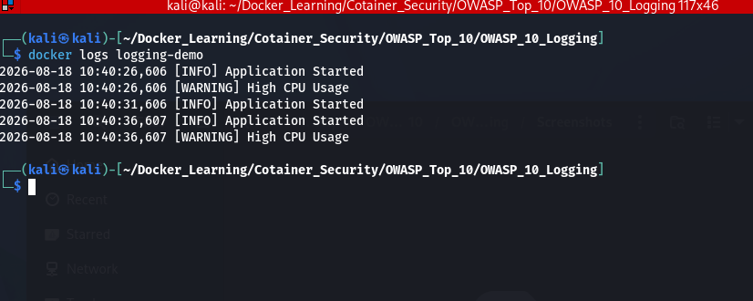
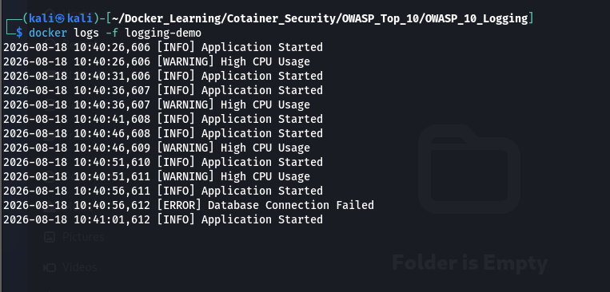
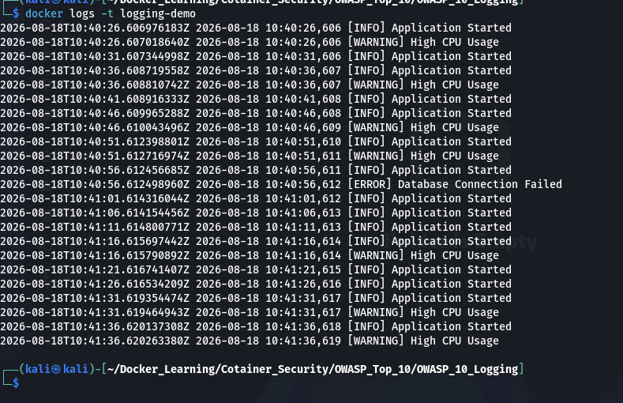

# OWASP Docker Top 10 #10 – Logging

## Overview

Logging is a critical security practice for monitoring containerized applications, detecting suspicious activities, troubleshooting issues, and supporting incident response.

Docker automatically captures everything written to **stdout** and **stderr** by an application and stores it using a logging driver (default: `json-file`).

---

## Lab Objective

This lab demonstrates:

- Viewing container logs
- Monitoring live application logs
- Displaying logs with timestamps
- Understanding Docker's default logging mechanism

---

## Project Structure

```text
OWASP_10_Logging/
│
├── Dockerfile
├── app.py
├── README.md
└── Screenshots/
```

---

## Build Docker Image

```bash
docker build -t owasp10:v1 .
```

---

## Run Container

```bash
docker run -d --name logging-demo owasp10:v1
```

---

## View Container Logs

Display all logs generated by the application.

```bash
docker logs logging-demo
```

---

## Monitor Live Logs

Follow logs in real time.

```bash
docker logs -f logging-demo
```

Press **Ctrl + C** to stop following the logs.

---

## Display Logs with Timestamps

Display logs along with their timestamps.

```bash
docker logs -t logging-demo
```

---

# Screenshots






## Docker Logs

Displays the application logs captured by Docker.


---

## Live Logs

Shows real-time log monitoring using the `docker logs -f` command.


---

## Logs with Timestamps

Displays log entries along with timestamps for easier debugging and auditing.


---

# Best Practices

- Write application logs to **stdout** and **stderr**.
- Avoid storing logs inside the container filesystem.
- Enable log rotation to prevent excessive disk usage.
- Forward logs to centralized logging platforms such as **ELK Stack**, **Splunk**, **Loki**, or **Fluentd**.
- Monitor logs regularly for suspicious activities and security incidents.
- Protect logs from unauthorized modification or deletion.

---

# OWASP Recommendation

Centralize, isolate, and aggregate container logs to improve monitoring, incident response, and forensic investigations.

---

# Conclusion

This lab demonstrates Docker's built-in logging capabilities and highlights the importance of collecting application logs through stdout/stderr. Proper logging improves visibility into container behavior, simplifies troubleshooting, and supports security monitoring in production environments.
